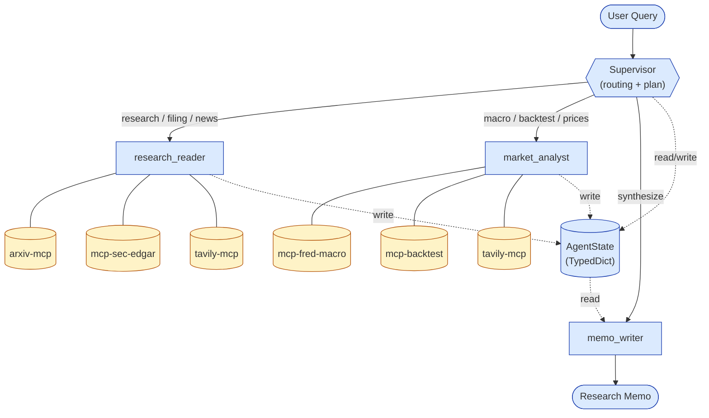

# DESIGN.md — quant-research-copilot

> **Version:** v0.1 (initial draft)
> **Date:** 2026-04-22
> **Owner:** Haichuan Zhou
> **Status:** Scope = Medium (7 sections). Failure Modes + Open Questions deferred to v1.0 per ADR.
> **Next upgrade:** v0.5 after Stage 5 (LangGraph skeleton in place).

---

## Version History


| Version | Date       | Summary                                                                                                                                                                                 |
| ------- | ---------- | --------------------------------------------------------------------------------------------------------------------------------------------------------------------------------------- |
| v0.1    | 2026-04-22 | Initial draft. Architecture + AgentState + node contracts + tool signatures + routing intent + baseline metrics. AgentState fields and tool return shapes marked`FILL IN` for Haichuan. |

---

## 1 · Goals & Non-Goals

### Goals

A multi-agent copilot that answers quantitative research questions by combining four evidence streams — research papers, SEC filings, macro time series, and back-test results — into a single synthesized research memo.

Concretely, v1 is done when the system can:

- Accept a natural-language query about a strategy, paper, or market regime.
- Route the query through a supervisor to one or more specialist sub-agents.
- Call 5 MCP servers (3 self-authored, 2 community) via `langchain-mcp-adapters` over stdio.
- Produce a memo that cites its evidence and reports quantitative results.
- Emit a LangSmith trace for every run, with token counts, latency, and cost attached.
- Publish a baseline table of 40 canonical queries × 3 agent architectures (supervisor / ReAct / Swarm).

### Non-Goals

- **No live trading.** No broker integration, no order routing, no real-money positions. Back-tests are offline simulations on yfinance Parquet caches.
- **No HFT or low-latency design.** Query latency budget is 30–120 seconds end-to-end; architecture is deliberately stdio-bound.
- **No user-facing web UI in v1.** Interaction is via FastAPI endpoint (Stage 13) + LangSmith trace viewer.
- **No proprietary data.** All sources are free/public (SEC EDGAR, FRED, arxiv, yfinance, tavily).
- **No novel research methodology.** Back-test strategies replicate published methods (e.g. Jegadeesh & Titman 1993 momentum). This is a *tooling* project, not a quant-research project.

### Success criteria (quantitative)

- Stage 7 baseline published: tokens, latency, cost per query.
- Stage 12 eval: 40 queries × 3 architectures, 4 metrics charts (routing / accuracy / cost / latency).
- 3 MCP servers open-sourced as standalone public GitHub repos + submitted to `modelcontextprotocol/servers` community registry.

---

## 2 · System Architecture

A single-process LangGraph coordinates one supervisor node and three specialist sub-agents. Each sub-agent owns a bounded set of MCP server subprocesses, launched on demand via `langchain-mcp-adapters`. The supervisor never touches MCPs — it is pure routing logic.

### Diagram



### Control flow vs data flow

Control flow and data flow are deliberately separated:

**Control flow** is the LangGraph edge structure. The supervisor is re-entered after every sub-agent returns; it decides `next_agent` based on the updated `AgentState`. The graph terminates when `memo_writer` finishes.

**Data flow** is `AgentState` — a shared TypedDict threaded through every node. Sub-agents never pass data to each other directly; they only read from and write to `AgentState`. This is what makes multi-turn coordination work without ad-hoc coupling between sub-agents.

### Process model

- **LangGraph process** (1 Python process): holds the supervisor, the 3 sub-agents, and the shared `AgentState`.
- **MCP processes** (up to 5 subprocesses): each MCP server is spawned by `langchain-mcp-adapters` as a stdio-talking subprocess. Lifetime = sub-agent's turn. Killed on completion to keep resource use bounded.
- **Tracing**: LangSmith observes everything in the LangGraph process. MCP calls emit custom metadata events so they appear in the same trace.

### Why supervisor, not ReAct or Swarm?

Stage 12 will eval all three; supervisor is the v1 default because it gives the clearest routing audit trail (every routing decision is one LLM call with a logged reason). ReAct conflates routing and tool use; Swarm has no central place to inspect routing. For an interview-visible project, explicit routing wins on clarity.

---

## 3 · AgentState Schema

`AgentState` is a `TypedDict` threaded through every node. It is the single source of truth for "what's in flight" — every field has exactly one writer (the node that produces it) and any number of readers.

### Design principles

- **Flat, not nested.** Avoid `state["research"]["paper"]["metadata"]` chains. Nesting encourages silent schema drift.
- **Optional by default.** Most fields are populated mid-graph; mark `Optional[...]` so type checkers catch missing-field reads.
- **Messages list for LLM history.** Standard LangGraph pattern — `messages: List[AnyMessage]` accumulates across turns.
- **Meta fields for tracing.** `tokens_used`, `cost_usd`, `mcp_calls` etc. are first-class state so LangSmith can emit them without side channels.

### Skeleton (Claude-drafted)

```python
from typing import TypedDict, List, Dict, Any, Optional
from langchain_core.messages import AnyMessage

class AgentState(TypedDict):
    # ─────────── User input ───────────
    query: str                              # the user's natural-language question

    # ─────────── Supervisor routing ───────────
    next_agent: Optional[str]               # "research_reader" | "market_analyst" | "memo_writer" | "END"
    plan: Optional[List[str]]               # high-level steps, populated by supervisor on first turn
    routing_history: List[Dict[str, Any]]   # each entry: {turn, agent, reason}

    # ─────────── research_reader output ───────────
    # FILL IN (Haichuan): add concrete fields for paper metadata, filings excerpts, news digest
    paper_id: Optional[str]
    paper_summary: Optional[str]
    filings_excerpts: Optional[List[Dict[str, Any]]]  # [{ticker, accession, section, text}, ...]
    news_items: Optional[List[Dict[str, Any]]]        # [{title, source, url, published_at}, ...]

    # ─────────── market_analyst output ───────────
    # FILL IN (Haichuan): concrete types for market_data / backtest / macro
    market_data: Optional[Dict[str, Any]]
    backtest_result: Optional[Dict[str, Any]]         # {run_id, sharpe, max_dd, cagr, yearly_pnl, ...}
    macro_context: Optional[Dict[str, Any]]           # {series_id: aligned DataFrame / list}

    # ─────────── memo_writer output ───────────
    memo_draft: Optional[str]                          # markdown
    memo_grade: Optional[Dict[str, Any]]              # set by Stage 8 reflection

    # ─────────── Meta / tracing ───────────
    messages: List[AnyMessage]                         # LangGraph message log
    tokens_in: int
    tokens_out: int
    cost_usd: float
    mcp_calls: List[Dict[str, Any]]                   # [{server, tool, args, latency_ms}, ...]
```

> **FILL IN (Haichuan):** Replace the three `Optional[Dict[str, Any]]` placeholders with concrete `TypedDict`s. Example: define `BacktestResult(TypedDict)` with `run_id: str`, `sharpe: float`, `max_dd: float`, `cagr: float`, `yearly_pnl: List[float]`. Concrete types let Pydantic/Pyright catch node-contract violations before runtime.

### Writer ownership (one field, one writer)


| Field                                                         | Written by                                                   |
| ------------------------------------------------------------- | ------------------------------------------------------------ |
| `query`                                                       | graph input                                                  |
| `next_agent`, `plan`, `routing_history`                       | `supervisor`                                                 |
| `paper_id`, `paper_summary`, `filings_excerpts`, `news_items` | `research_reader`                                            |
| `market_data`, `backtest_result`, `macro_context`             | `market_analyst`                                             |
| `memo_draft`, `memo_grade`                                    | `memo_writer`                                                |
| `messages`                                                    | appended by every node (LangGraph convention)                |
| `tokens_in`, `tokens_out`, `cost_usd`, `mcp_calls`            | any node — wrapped in an`update_metrics(state, ...)` helper |

If a new node needs to write a field another node owns, add a new field — do not share writers.

---

## 4 · Node Contracts

One section per node. Each contract specifies: what the node reads, what it writes, which MCPs it may call, and what triggers it to return.

### 4.1 supervisor

**Role:** decide the next agent to run and (on first turn) produce a high-level plan.

**Reads:** `query`, `plan`, `routing_history`, last N entries of `messages`.
**Writes:** `next_agent`, `plan` (first turn only), appends to `routing_history`.
**MCPs:** none. Supervisor is pure LLM routing.
**Termination:** returns `next_agent = "END"` when the graph should halt (typically after `memo_writer` produces a draft).

**Input prompt shape:** system prompt with routing rules (Section 6) + 3 few-shot examples + current state summary. Current state is serialized to a compact string, not the raw TypedDict — keeps tokens in check.

**Output contract:** a structured output object (`{"next_agent": str, "plan": Optional[List[str]], "reason": str}`) parsed via LangChain's `with_structured_output` binding. The `reason` field is not written to state but is emitted as LangSmith metadata.

### 4.2 research_reader

**Role:** gather evidence from external sources — arxiv papers, SEC filings, news.

**Reads:** `query`, `plan`, current `routing_history` entry.
**Writes:** `paper_id`, `paper_summary`, `filings_excerpts`, `news_items` (whichever are relevant).
**MCPs allowed:** `arxiv-mcp`, `mcp-sec-edgar`, `tavily-mcp`.
**Termination:** one sub-agent turn = one category of evidence (paper *or* filings *or* news). If the plan requires multiple categories, supervisor re-routes back to `research_reader` on the next turn.

**Why one-category-per-turn:** keeps traces linear and makes routing decisions visible. A sub-agent that ran 5 MCP tools in one turn is hard to debug; 5 supervisor turns each with a one-tool sub-agent is not.

### 4.3 market_analyst

**Role:** run back-tests and resolve macro context.

**Reads:** `query`, `plan`, `paper_summary` (if present — strategy may be drawn from a paper), `routing_history`.
**Writes:** `market_data`, `backtest_result`, `macro_context`.
**MCPs allowed:** `mcp-fred-macro`, `mcp-backtest`, `tavily-mcp` (fallback for missing macro context).
**Termination:** one turn = one of {run a back-test, fetch macro, fetch prices}. Same atomicity rule as `research_reader`.

**Backtest idempotency note:** `mcp-backtest.run_backtest(...)` returns a `run_id`. If `market_analyst` is re-invoked with identical params, the MCP's cache layer returns the same run_id — no duplicate computation. This is intentional to keep the graph deterministic across LangGraph's retry policies (Stage 11).

### 4.4 memo_writer

**Role:** synthesize everything in `AgentState` into a single research memo.

**Reads:** `query`, `paper_summary`, `filings_excerpts`, `news_items`, `market_data`, `backtest_result`, `macro_context`, `messages`.
**Writes:** `memo_draft`, `memo_grade` (after Stage 8 reflection is added).
**MCPs allowed:** none. Pure LLM synthesis, no new evidence fetched.
**Termination:** produces a first complete draft. Stage 8 will add a reflection loop that can grade the draft and trigger one rewrite pass (up to 2 iterations).

**Why no MCP access:** forces the memo to be strictly a function of what evidence-gathering agents have already collected. If `memo_writer` could fetch new data mid-synthesis, traces become non-deterministic and reviews become hard.

---

## 5 · MCP Tool Signatures (v0.1)

Tools listed here are v0.1 intent. Concrete argument types, return shapes, and error semantics are marked `FILL IN` where Haichuan hand-writes the MCP implementation.

### 5.1 mcp-sec-edgar (self-authored)

**Purpose:** read-only access to SEC EDGAR filings + US index constituents.

```python
class Constituent(TypedDict):
    ticker: str
    name: str
    sector: str
    weight: Optional[float]
# tools
get_index_constituents(index: str, as_of_date: date) -> List[Constituent]
    # Example call: get_index_constituents("sp500", date(2025, 1, 1)) → list of 500 dicts

search_filings(ticker: str, form_type: str, limit: int) -> List[FilingMeta]
    # FILL IN: FilingMeta = {"accession_number": str, "filed_date": date, "form": str, "url": str}
    # form_type ∈ {"10-K", "10-Q", "8-K", ...}

get_filing_section(accession_number: str, section: str) -> str
    # FILL IN: section enum — candidates: {"item_1_business", "item_1a_risk",
    #          "item_7_mdna", "item_8_financials"}
    # Returns plain text (HTML stripped).

# resources
constituents://{index}/{date}   # e.g. constituents://sp500/2025-01-01 → returns List[Constituent]

# extensibility slot
# IndexRegistry protocol — see mcp-sec-edgar/src/mcp_sec_edgar/registries/index_registry.py
# Default impl: SP500Index. Future: Russell1000Index, Nasdaq100Index.
```

### 5.2 mcp-fred-macro (self-authored)

**Purpose:** read-only access to FRED macroeconomic time series.

```python
# tools
search_series(keyword: str, limit: int) -> List[SeriesMeta]
    # FILL IN: SeriesMeta = {"series_id": str, "title": str, "units": str, "freq": Literal["D","W","M","Q","A"]}

get_series(series_id: str, start: date, end: date) -> List[Tuple[date, float]]
    # FILL IN: return type — list-of-tuples vs DataFrame?
    # Recommendation: list-of-tuples at the MCP boundary (JSON-serializable);
    # caller-side converts to pandas if needed.

align_series(series_ids: List[str], start: date, end: date, freq: str) -> Dict[str, List[Tuple[date, float]]]
    # FILL IN: freq enum — "D" | "W-FRI" | "M" | "Q" | "A"
    # FILL IN: resample policy — via ResamplePolicy protocol (ffill | interpolate | last)

# resources
meta://{series_id}              # e.g. meta://DFF → {series_id, title, units, freq, last_updated}

# extensibility slot
# ResamplePolicy protocol — see mcp-fred-macro/src/mcp_fred_macro/registries/resample_policy.py
# Default impl: ForwardFillPolicy. Future: InterpolatePolicy, LastObservationPolicy.
```

### 5.3 mcp-backtest (self-authored)

**Purpose:** launch and retrieve quantitative back-tests against yfinance price data.

```python
# tools
list_strategies() -> List[str]
    # e.g. ["momentum_12_1", "mean_reversion_5d", ...]

run_backtest(strategy: str, universe: List[str], start: date, end: date, params: Dict[str, Any]) -> str
    # Returns run_id (SHA-256 of (strategy, universe, start, end, params))
    # Idempotent — same args → same run_id → cached result

get_backtest_result(run_id: str) -> BacktestResult
    # FILL IN: BacktestResult = {
    #     "run_id": str, "strategy": str, "universe": List[str],
    #     "start": date, "end": date,
    #     "sharpe": float, "max_dd": float, "cagr": float,
    #     "yearly_pnl": List[float], "equity_curve": List[Tuple[date, float]],
    # }

# resources
result://{run_id}               # returns full BacktestResult as JSON

# extensibility slot
# Strategy Protocol — see mcp-backtest/src/mcp_backtest/registries/strategy.py
# Default impl: MomentumStrategy(lookback=12, skip=1)  [Jegadeesh & Titman 1993]
# Future: MeanReversionStrategy, PairsTradingStrategy.
```

### 5.4 arxiv-mcp (community)

**Purpose:** full-text arxiv paper access. Community-provided; signatures shown for reference only.

```python
search_arxiv(query: str, max_results: int = 10) -> List[PaperMeta]
    # PaperMeta = {"arxiv_id": str, "title": str, "abstract": str, "authors": List[str]}

download_paper(arxiv_id: str) -> str
    # Returns full paper text (PDF-extracted, may be messy).
```

### 5.5 tavily-mcp (community)

**Purpose:** general web search fallback. Used by `research_reader` (news) and `market_analyst` (missing macro context).

```python
tavily_search(query: str, max_results: int = 5) -> List[SearchResult]
    # SearchResult = {"title": str, "url": str, "snippet": str, "published_at": Optional[str]}
```

---

## 6 · Routing Rules (Supervisor)

Supervisor is LLM-driven but scaffolded by three tiers of rules, from most deterministic to least.

### Tier 1 — Explicit marker in query

If the query contains an explicit keyword, route directly without LLM routing:


| Marker                                              | Route             |
| --------------------------------------------------- | ----------------- |
| `"backtest"`, `"run a backtest"`, `"test strategy"` | `market_analyst`  |
| `"summarize paper"`, `"read arxiv"`, `"arxiv:"`     | `research_reader` |
| `"10-K"`, `"10-Q"`, `"sec filing"`                  | `research_reader` |
| `"fed rate"`, `"cpi"`, `"macro"`                    | `market_analyst`  |

### Tier 2 — Content-type heuristics

If no Tier-1 marker, LLM reads the query + routing rules in the system prompt. Decision space:

- Paper or filing mentioned → `research_reader`
- Backtest concept (sharpe, returns, strategy name) → `market_analyst`
- Macro concept (rates, inflation, unemployment) → `market_analyst`
- Both research and market aspects → `research_reader` first (evidence before analysis)

### Tier 3 — Stage-based progression

Independent of content — if the graph state indicates progress, override:

- If `research_reader` and `market_analyst` have both populated their fields → `memo_writer`
- If `memo_draft` is populated → `END`
- If `routing_history` shows 5+ turns without `memo_writer` entry → force `memo_writer` (prevents infinite exploration)

### Few-shot examples (seed the routing prompt)

**Example A — research-first:**
Query: *"Summarize the main claim of arxiv 2408.12345 and check if any SP500 10-K filings corroborate."*
Expected routing: `research_reader` (arxiv) → `research_reader` (SEC) → `memo_writer`

**Example B — backtest-first:**
Query: *"Does 12-1 momentum still work on SP500 2020–2024?"*
Expected routing: `market_analyst` (backtest) → `market_analyst` (fred for rate regime context) → `memo_writer`

**Example C — mixed:**
Query: *"Has the Fed's rate cycle affected momentum strategy performance in 2022–2024?"*
Expected routing: `market_analyst` (fred) → `market_analyst` (backtest) → `research_reader` (tavily news) → `memo_writer`

### Anti-patterns

Do **not**:

- Route to `memo_writer` before any evidence-gathering agent has run.
- Re-enter `research_reader` more than 3 consecutive times (force progression).
- Route to `market_analyst` for pure paper-reading queries, even if the paper discusses numerical results.
- Emit `next_agent` values not in the enum — structured output parsing will reject these.

---

## 7 · Baseline Metrics to Track

The single most interview-valuable output of this project is a real baseline table: tokens, latency, cost, routing accuracy. Instrument from day 1 — do not bolt metrics on after the fact.

### Metric catalog


| Metric                  | Unit           | Captured at          | Storage                         |
| ----------------------- | -------------- | -------------------- | ------------------------------- |
| `total_tokens_in`       | int            | end of graph         | LangSmith run + local SQLite    |
| `total_tokens_out`      | int            | end of graph         | LangSmith                       |
| `total_cost_usd`        | float          | end of graph         | LangSmith                       |
| `end_to_end_latency_ms` | int            | end of graph         | LangSmith                       |
| `supervisor_turns`      | int            | per graph run        | LangSmith                       |
| `routing_decisions`     | List[Dict]     | each supervisor call | `routing_history` in AgentState |
| `mcp_calls`             | List[Dict]     | each MCP invocation  | `mcp_calls` in AgentState       |
| `mcp_call_latency_ms`   | Dict[str, int] | each MCP invocation  | LangSmith metadata              |
| `node_latency_ms`       | Dict[str, int] | each node invocation | LangSmith                       |
| `reflection_iterations` | int (0–2)     | Stage 8 only         | AgentState                      |

### Per-query vs aggregate

Per-query metrics are the rows. Aggregate metrics (p50/p95/p99 latency, cost distribution, routing accuracy) are computed by the eval runner in Stage 12 across 40 canonical queries × 3 architectures.

### Baseline publication (Stage 7 deliverable)

Publish a one-table baseline as part of the README + blog:


| Query category | N queries | p50 latency | p50 cost | avg tokens | avg MCP calls |
| -------------- | --------- | ----------- | -------- | ---------- | ------------- |
| Research-first | 10        | —          | —       | —         | —            |
| Backtest-first | 10        | —          | —       | —         | —            |
| Macro          | 10        | —          | —       | —         | —            |
| Mixed          | 10        | —          | —       | —         | —            |

(Values populated at Stage 7.)

### Instrumentation principles

- **One trace per query.** LangSmith trace spans the full graph, not per-node.
- **No silent fallbacks.** Every retry, backoff, and fallback route shows up in the trace.
- **Cost at end of query.** Sum tokens × unit price after the graph terminates — avoids double-counting on re-entry.
- **Metrics live in state.** Any metric the memo or downstream analysis needs is written into `AgentState`. Nothing hidden in per-tool logs.
- **Distinguish LLM vs MCP latency.** `node_latency_ms[agent]` measures full node time; `mcp_call_latency_ms[tool]` isolates MCP round-trips. Subtraction gives LLM thinking time.

---

## Appendix A — Document evolution plan

This is a living document. v0.1 is intentionally lean. Planned update cadence:


| After                                | Change                                                                                                                          |
| ------------------------------------ | ------------------------------------------------------------------------------------------------------------------------------- |
| Stage 5 (LangGraph skeleton)         | Finalize AgentState field types. Replace`Optional[Dict[str, Any]]` placeholders with concrete `TypedDict`s.                     |
| Stage 6 / 7 (MCPs wired)             | Revise tool signatures in Section 5 to match what the MCPs actually expose. Fill in return-type`FILL IN` markers.               |
| Stage 7 (baseline run)               | Paste real baseline numbers into Section 7 table.                                                                               |
| Stage 8 / 9 (Reflection + LangSmith) | Add a routing-accuracy sub-table to Section 6 based on LangSmith observations. Add`reflection_iterations` to Section 7 metrics. |
| Stage 10                             | Upgrade to v1.0 — add**Failure Modes** (full section, 8 categories + mitigations) + optional **Open Questions** section.       |

---

## Appendix B — Glossary

**AgentState** — the TypedDict threaded through every LangGraph node. Single source of truth for in-flight data.

**MCP (Model Context Protocol)** — JSON-RPC-over-stdio spec for exposing tools and resources to LLM-driven clients.

**Node** — a function in the LangGraph. One of: supervisor, research_reader, market_analyst, memo_writer.

**Sub-agent** — a specialist node bound to a specific set of MCPs.

**Supervisor** — the routing node that decides which sub-agent runs next. Never calls MCPs directly.

**Tool** — an RPC-callable function exposed by an MCP (e.g. `get_series`).

**Resource** — an RPC-callable identifier-addressable piece of data exposed by an MCP (e.g. `constituents://sp500/2025-01-01`).

**Run ID** — SHA-256 hash that identifies a cached back-test result. Produced by `mcp-backtest.run_backtest(...)`.

**Routing decision** — one supervisor LLM call's output: `{next_agent, reason}`. Appended to `routing_history`.

---

*End of v0.1 · Target next revision: v0.5 after Stage 5 completes.*
